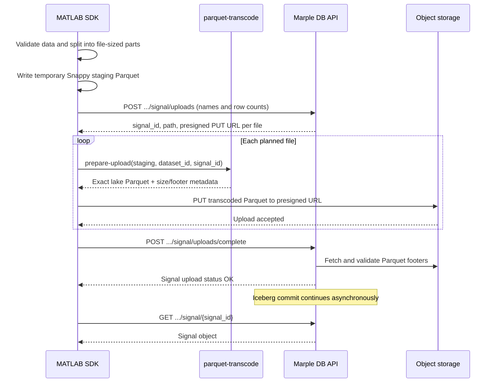

# MATLAB `add_signal` contract

This document defines MATLAB SDK parity with Python
`Dataset.add_signal`. It covers the public MATLAB API and the Marple DB
wire/storage protocol. Batch `add_signals` support is outside the initial
scope, although the backend protocol is batch-oriented.

## Public MATLAB API

```matlab
signal = mdb.add_signal( ...
    stream_name, dataset_id, name, data, ...
    Metadata=struct(), Overwrite=false, Priority="default")
```

### Inputs

- `stream_name`: datastream name, resolved in the same way as
  `get_signals`.
- `dataset_id`: numeric ID of an existing imported dataset in the stream.
- `name`: non-empty signal name.
- `data`: either:
  - a MATLAB table with `time` and at least one of `value` or
    `value_text`; or
  - a path to a Parquet file with those columns.
- `Metadata`: a value that `jsonencode` serializes as a JSON object.
  Signal metadata such as `unit` belongs here. The backend promotes
  `unit` and `description` to dedicated signal fields. Reserved
  `_mdb_*` upload metadata is server-owned and cannot be spoofed.
- `Overwrite`: when `false`, an existing signal with the same name is a
  conflict. When `true`, it is replaced.
- `Priority`: `"default"` or `"high"`.

`time` is signed `int64` Unix time in nanoseconds. It must contain no
missing values and must be non-negative. `value` must be convertible to
`double`; non-finite values are stored as null. `value_text` must be
convertible to strings. Extra input columns are ignored. The table must
contain at least one row.

The signal's `[min(time), max(time)]` range must overlap the dataset's
time range when both dataset bounds are known. Samples do not need to
cover the full dataset range.

### Result and availability

The method returns the decoded signal object from:

```text
GET /stream/{stream_id}/dataset/{dataset_id}/signal/{signal_id}
```

The return happens after upload completion has been accepted, but before
the asynchronous Iceberg commit necessarily finishes. The signal may
therefore still have a transitional storage status. This method does not
wait for the signal to become readable.

### Public errors

The method raises a MATLAB error when:

- local input validation fails;
- the API rejects the presign or completion request;
- a storage PUT fails;
- the completion response reports a non-`OK` signal status; or
- the newly allocated signal cannot be fetched.

API errors should include each returned signal's `name` or `id`,
`status`, and `message` where available. Upload status values are:

- `OK`
- `DUPLICATE`
- `EXISTS`
- `SIZE_INVALID`
- `NOT_FOUND`
- `NOT_API_UPLOAD`
- `ALREADY_UPLOADED`
- `INVALID_PARQUET`

`EXISTS` and `DUPLICATE` produce HTTP 409. Other upload validation
failures produce HTTP 400. Normal authentication, authorization, not
found, and FastAPI request-validation errors retain their API status.

## Upload protocol

All API calls use the normal Bearer authorization and
`X-Request-Source: sdk/matlab`. The presigned storage URLs must be used
without the API authorization header. Both API endpoints require an
authenticated user or token with at least the `editor` role; no admin
role is required.

### Component interaction



The division of responsibilities is:

- MATLAB owns user-facing validation, file planning, temporary-file
  lifecycle, API calls, storage PUTs, and aggregate signal statistics.
- The API owns signal allocation, authorization, overwrite behavior,
  storage paths, presigned URLs, final validation, and Iceberg commit
  scheduling.
- `parquet-transcode` owns the final uploaded Parquet representation. It
  must not depend on the MATLAB release's Arrow schema or compression
  support.

### 1. Validate, plan, and stage files

Normalize the input to:

```text
time        int64,  required
value       float64, nullable
value_text  string, nullable
```

Fill an omitted value column with nulls. Split the rows into files of at
most `16,777,216` rows (`16 * 1,048,576`). This produces full-sized
files followed by at most one smaller final file, satisfying the backend
rule that at most one file may contain fewer than `8,388,608` rows.

Estimate frequency in hertz as `1e9 / median(diff(time))` for positive
time differences. Use `null` when it cannot be estimated. Compute
`sum(value)` over non-null numeric values, or `null` when there are none.

Before calling the API, MATLAB writes one temporary Snappy staging
Parquet per planned file. A staging file contains only:

```text
time        int64
value       float64 or null
value_text  string or null
```

The staging schema is intentionally not the Iceberg schema. In
particular, it has no `dataset` or `signal` columns and may contain
MATLAB's `LargeString` Arrow representation. Snappy is used because it
works across old MATLAB releases. Staging before presign ensures that
MATLAB serialization does not consume the presigned URL lifetime and
that failures at this stage create no server-side placeholder signal.

Row-group layout and field metadata in staging files are not
authoritative. The helper controls them in the final files.

### 2. Presign

```text
POST /stream/{stream_id}/dataset/{dataset_id}/signal/uploads
```

Request:

```json
{
  "signals": [
    {
      "name": "car.speed_kmh",
      "metadata": {"unit": "km/h"},
      "files": [
        {"index": 0, "rows": 1000}
      ],
      "priority": "default"
    }
  ],
  "overwrite": false
}
```

The current backend request model ignores `priority` during presign; it
is included here for parity with the Python request and is sent again at
completion.

Successful response:

```json
[
  {
    "name": "car.speed_kmh",
    "signal_id": 123,
    "files": [
      {
        "index": 0,
        "rows": 1000,
        "path": "cold/path/file.parquet",
        "url": "https://presigned-storage-url",
        "expires_in": 3600
      }
    ]
  }
]
```

The client must correlate responses by `name` and files by `index`, not
by response ordering alone.

`Overwrite=true` is destructive and not transactional: the backend
deletes the existing same-name signal before the storage upload and
completion steps. A later failure can therefore leave an incomplete API
upload placeholder rather than restore the previous data. The backend
normally reuses the signal's existing datapool-level ID.

### 3. Transcode and upload Parquet

After presign returns the allocated `signal_id`, MATLAB invokes the
helper once for each staging file. The proposed helper interface is:

```text
parquet-transcode prepare-upload \
  --input <staging.parquet> \
  --output <upload.parquet> \
  --dataset-id <dataset_id> \
  --signal-id <signal_id> \
  [--expected-rows <n>]
```

Row-group size (`1_048_576`) and ZSTD compression are fixed production
settings, not CLI flags.

The helper must stream record batches rather than load the complete
staging file into memory. It validates the three staging columns, casts
MATLAB `LargeString` values to Arrow UTF-8 string, inserts the constant
identity columns, and writes the authoritative lake schema.

For every presigned file, the helper writes a Parquet object with this
exact column order and logical schema:

| Column | Arrow type | Nullable | Parquet field ID | Value |
| --- | --- | --- | --- | --- |
| `dataset` | `int64` | no | 1 | `dataset_id` on every row |
| `signal` | `int64` | no | 2 | allocated `signal_id` on every row |
| `time` | `int64` | no | 3 | input nanoseconds |
| `value` | `float64` | yes | 4 | numeric value or null |
| `value_text` | UTF-8 string | yes | 5 | text value or null |

The file must include Parquet min/max statistics for `dataset`,
`signal`, and `time`, plus null-count statistics for both value columns.
The backend verifies that `dataset` and `signal` min/max equal the
expected IDs and that time min/max are present. ZSTD is the parity
compression used by Python. Compression is not part of the backend API
contract, but helper-produced upload files use ZSTD consistently on
every supported MATLAB release.

On success, the helper emits one machine-readable JSON object to stdout:

```json
{
  "output": "/tmp/upload.parquet",
  "rows": 1000,
  "size": 123456,
  "footer": 789
}
```

`rows` must equal the count sent during presign. `size` and `footer`
describe the final transcoded file, not the Snappy staging file. Any
diagnostic logging goes to stderr so MATLAB can parse stdout reliably.

Upload the file bytes with HTTP PUT to the corresponding `url` before
`expires_in` elapses. Record:

- `path`: exactly the path returned by presign;
- `size`: final file size in bytes;
- `footer`: the little-endian Parquet footer length stored in the four
  bytes immediately before the trailing `PAR1` magic, excluding the
  final eight bytes.

### 4. Complete

Only call complete after every PUT has succeeded:

```text
POST /stream/{stream_id}/dataset/{dataset_id}/signal/uploads/complete
```

Request:

```json
{
  "signals": [
    {
      "id": 123,
      "priority": "default",
      "stats": {
        "sum": 42.5,
        "frequency": 100.0
      },
      "files": [
        {
          "path": "cold/path/file.parquet",
          "size": 123456,
          "footer": 789
        }
      ]
    }
  ]
}
```

Successful response:

```json
[
  {"name": null, "id": 123, "status": "OK", "message": null}
]
```

The backend fetches each footer from storage, validates the schema,
identity columns, file sizing, and statistics, and then queues the
signal for the Iceberg cold commit.

Signals added through this API belong to the imported dataset version.
Re-ingesting that dataset removes its API-uploaded signals.

MATLAB removes staging and transcoded temporary files after success or
failure. If a failure occurs after presign, MATLAB must not call
complete. There is currently no cancellation endpoint, so the allocated
`FROZEN_TO_COLD` placeholder can remain server-side and the error must
state that explicitly.

## SDK and backend validation boundary

The MATLAB client must enforce the same time-range overlap rule as the
Python SDK. The backend currently validates Parquet time statistics but
does not reject samples outside the dataset range. Likewise, the Python
SDK's 10,000-signal batch limit is client-only; it does not affect this
single-signal MATLAB method.

## MATLAB compatibility strategy

MATLAB's native `parquetwrite` is only a staging writer. It does not
expose Iceberg/Parquet field IDs, writes MATLAB strings as Arrow
`LargeString`, defaults to Snappy, and only gained explicit row-group
control in R2022a. Consequently, a native MATLAB Parquet file must never
be uploaded directly.

Extending the existing Rust `parquet-transcode` binary makes the final
format independent of the MATLAB release. The existing directory
transcoding command used for downloads remains backward compatible;
`prepare-upload` is an additional command with strict schema validation
and streaming I/O.

## Sources of truth

- Python SDK:
  - `python/src/marple/db/dataset.py`
  - `python/src/marple/db/signal_upload.py`
  - `python/src/marple/db/constants.py`
  - `python/tests/test_signal_upload.py`
- Marple DB `add-signals` branch:
  - `muhandis/api/routers/v1/endpoints.py`
  - `muhandis/ingest/signal.py`
  - `muhandis/types.py`
  - `muhandis/core/schema.py`

The endpoints are not present on the currently checked-out muhandis
branch; this contract follows the local `add-signals` branch, whose tip
was `5939e67d` when this document was written.
